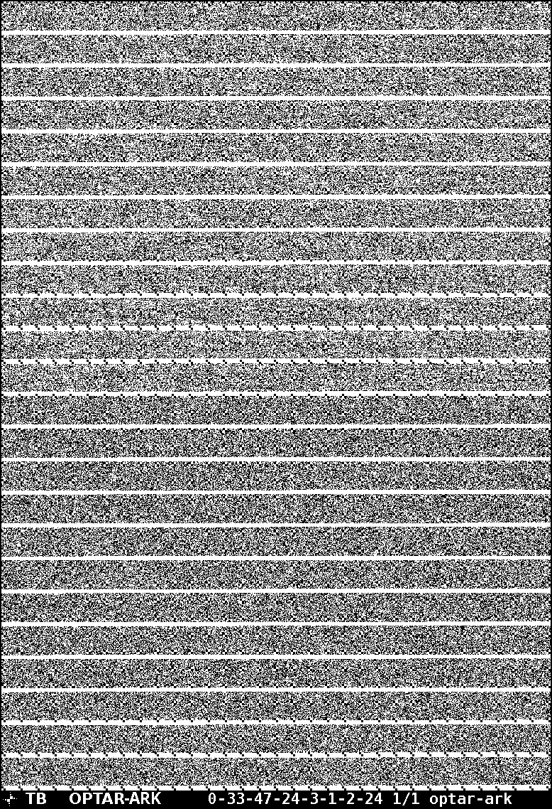

# Arkanic's Twibright-OPTAR
This is a tool to represent and recover data (such as files, strings of text, or tarballs) with 2D barcodes on a printed medium, resulting in 100-200KB of data per page.



The original project, [Twibright OPTical ARchiver](http://ronja.twibright.com/optar/), was released in 2007. This fork aims to enhance the usability and modularity of the program, with the optimal end goal in mind being a web-based client.

## Features (intended)
- [x] Support for configuration customisation without recompiling the source code
- [x] Add support for actually parsing the number string passed to `unoptar` to change unparse config, instead of ignoring and using compiled values in optar.h 
- [x] Commandline support for configuring standard paper sizes, with custom KB per page densities
- [x] Optar display more helpful information about kb per page etc
- [x] Support for multiple generic paper sizes without having to do annoying math
- [ ] Look into interleaving golay/data sections between pages for high page counts
- [75%] Modularisation of code so that it a) is all in one binary for cli usage and b) can be interfaced with as a c-style library
- [ ] Cross-compilation to WASM

## Building
The following libraries are required:
- libpng
- zlib1g (libz)

Simply run `make` to build. `optar` and `unoptar` will appear in the current directory.

## Usage

### Optar
`./optar <filename to encode> <base path>`

For example:

`./optar ball.png ball` will result in:

```
ball_0001.pgm
ball_0002.pgm
ball_0003.pgm
```
Printing these files for recovery later.

### Unoptar
`./unoptar <magic digits> <base path> > ball.png`

where magic digits is the sequence of digits at the bottom of the printed pages

For example:

`./unoptar 0-65-93-24-3-1-2-24 ball > ball.png`

Unoptar will read the following files in sequence:
```
ball_0001.png
ball_0002.png
ball_0003.png
```

## Contact
The best way to reach out would be by raising an issue on [Github](https://github.com/Arkanic/optar-ark)